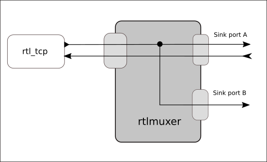

## rtlmuxer - rtl_tcp stream splitter

rtlmuxer acts very close to [rtl_mus](https://github.com/simonyiszk/rtl_mus), but it isn't an exact clone.

Application has one source connection and two sink ports: A and B.  
PortA - send IQ strem and commands in both directons.  
PortB - send IQ stream to consumers.  

Normally you should connect websdr to portA. Others passive IQ stream consumers should be connected to portB.

run example
_./tcp_split --src-address=192.168.1.200 --src-port=1234 --sink-bind-address=192.168.1.200 --sink-bind-port-a=2222 --sink-bind-port-b=2223_  
_./tcp_split --help_  

How to compile - just run `make`.  
Tested on linux only.

Alexander Sholohov <ra9yer@yahoo.com>
